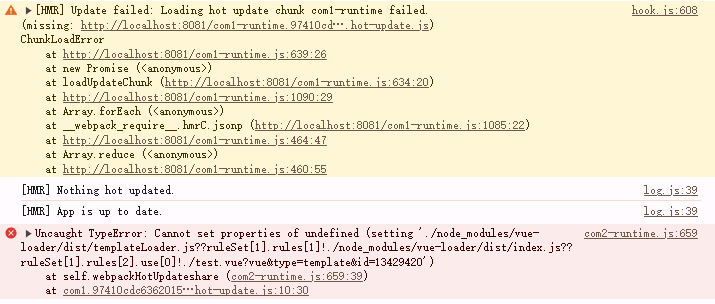

# What I want

I want to render 2 or mare vue component in other website with hmr service, but the hmr service always catch error and failed

# Reproduction process

- npm i
- npm run server
- Now, you can change test.vue or test2.vue, and you will catch follow error in `web console`: 

Please note: I has load vue in index.html and render component in index.html in `onload event`

# Other information

- I has try to add `runtime` config and it works bad
- I want the entry file is `.vue`
- Other possible methods I've thought of are
  - (1) provide ws link for every entry, just like what I say in my origin problem
  - (2) anyother configurations that can prevent them from affecting each other